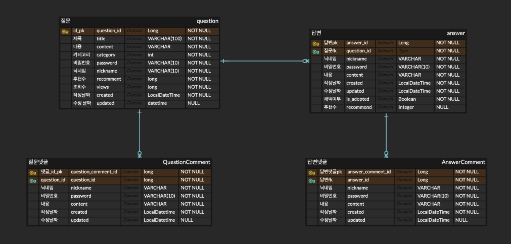

# mission-peerflow-BE 
This is simple website Backend mission for searching 42 subject.

42슬랙 general채널은 너무 불편합니다. 그래서 여러분은 general 채널을 대신할 질문-답변 사이트를 만드려고 합니다. 해당 서브젝트를 완료하면 RESTful과 API에 대해 이해할 수 있게 됩니다.

---
## 🚀 기능 요구 사항
이 레포지토리를 fork한 후 main에서 나만의 peerflow 서버를 만들어봅시다. 
branch와 pull request를 적극 활용해보세요!
> demo/prod 브랜치는 사용하지 않습니다. 

### 메인 화면
- 메인 화면에는 모든 글에 대한 조회가 있어야 합니다.
- 카테고리는 minishell, ft_irc, push_swap등 자유롭게 하되 총 3개의 카테고리 종류가 있어야 합니다. 카테고리를 눌렀을 때 해당 카테고리의 글만 조회할 수 있어야 합니다.
- 검색과 정렬이 가능해야 합니다. 검색은 제목 검색만 구현합니다. 정렬은 최신순, 조회순, 추천순으로 정렬할 수 있게 해야합니다.
- 페이지네이션이 구현되어있어야합니다
- 글을 조회했을 때는 다음과 같은 정보가 나와야 합니다. 
  - example
    - 질문 제목
    - 카테고리
    - 답글수
    - 추천수
    - 조회수
    - 작성자 닉네임
    - 작성일
- 메인 화면에서 새 글 버튼을 통해 새로운 질문을 작성 할 수 있어야 합니다.

### 상세 글 조회
- 조회한 글 중 하나를 클릭하면 해당 글의 내용이 모두 나오도록합니다.
  - 해당 글의 내용에는 질문, 답글, 질문 댓글, 답글 댓글이 있습니다.
  - example
    - 질문
      - 질문 제목
      - 질문 내용
      - 질문 작성자 닉네임
      - 질문 작성일 (createdAt)
      - 질문 수정일 (updatedAt)
      - 카테고리
      - 추천수, 조회수
    - 답변들
      - 답변 작성자 닉네임
      - 내용
      - 답변 작성일
      - 답변 수정일
      - 추천수
      - 채택여부
- 상세 글을 조회하면 그 글의 조회수가 증가하여야 합니다.
- 상세 글은 질문, 답글, 질문 댓글, 답글 댓글이 있다.
- 각 글의 댓글들 또한 페이지네이션이 구현되어 있어야 합니다.
- 해당 글과 그의 답글들 모두 추천을 누를 수 있어야합니다.
- 상세 글 작성자는 채택 버튼을 통해 답글을 채택 할 수 있어야 햔다.
  - 채택 시 상세 글의 비밀번호를 검증해야 합니다.

### 글쓰기 및 댓글
- 글쓰기(질문, 답글)를 구현해야합니다.
  - 글 작성 시 반드시 제목, 내용, 닉네임, 비밀번호를 입력해야 합니다.
  - 글의 수정 및 삭제는 글의 비밀번호로 판단합니다.
- 댓글 쓰기를 구현해야합니다.
  - 질문과 그 질문의 모든 답글에 댓글을 달 수 있어야 합니다.
  - 댓글 작성 시 반드시 내용, 닉네임, 비밀번호를 입력해야 합니다.
  - 수정 및 삭제의 댓글의 비밀번호로 판단합니다.

> 늘 그랬듯 무조건 subject에 있는 그대로 구현해야하는 것은 아닙니다. 만들어보고 싶은 기능이 있다면 추가해도 좋고, 주어진 entity 양식이나, API 명세 및 백엔드 설계를 더 좋은 방향이라고 생각하는대로 수정해도 좋습니다. 지금은 학습을 위한 시간이니까요.

> 다만 메인페이지에서 저장된 글들을 조회하고, 질문-답글-댓글의 CRUD, 추천, 채택과 같은 기능은 구현해야 합니다.
  
---

## 참고 사항
1. 처음 Build를 위한 초기 설정과 db setting방법을 제공합니다. 
   - [초기 설정](https://github.com/peer-42seoul/mission-peerflow-BE/issues/1)
2. 협업을 위한 컨벤션을 지켜봅시다.
   - [컨벤션](docs/01-컨벤션.md)
3. 기본적으로 엔티티 예시를 제공합니다.  
   - 
4. 기본적으로 API 명세를 제공합니다.
   - 더 좋은 방향으로 수정해도 좋습니다.
   - [API 명세](https://www.notion.so/peer-study/peerflow-api-5898f07da57546669a021e033fea47e9?pvs=4)

5. 디렉토리 안에 .keep 파일은 뭔가요?
   - 디렉토리 구조를 잡아놓기 위해 임의로 넣은 임시 파일입니다. 해당 디렉토리에 파일을 생성하셨다면 .keep파일을 지우셔도 괜찮습니다.
6. 시간상의 이유로 springboot 초기 설정과 entity 세팅을 하여 제공드리고 있습니다. 시간이 되신다면 build.gradle에 어떤 설정이 들어갔는지, 어떤 dependency가 있는지, 그리고 entity는 어떤 설정이 들어갔는지 공부해보시는 것도 추천드립니다. 

---
## Bonus
- 더 안전한 서버를 만들기 위해 Junit을 위한 test code를 작성해봅시다. 
- request를 실패했을 때 error handling과 http error status을 고려해봅시다.
- 프론트와의 협업을 위해 swagger나, Spring REST docs를 적용해봅시다. 

> 하지만 당연하게도 이 세가지는 필수가 아닙니다. 기능 요구 사항을 모두 충족하고 시간이 남는다면 도전해보세요.

---
> 어떤 방식으로 구현하든 자유지만 왜 그렇게 구현했는지 스스로의 이유를 생각하면서 만들어봅시다!
